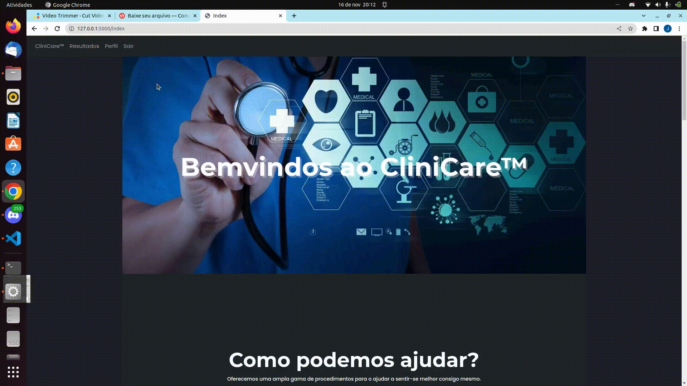
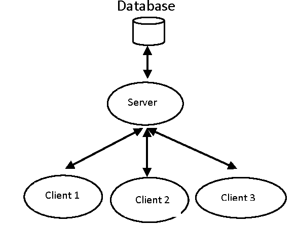
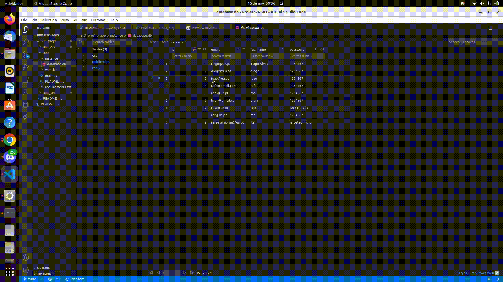
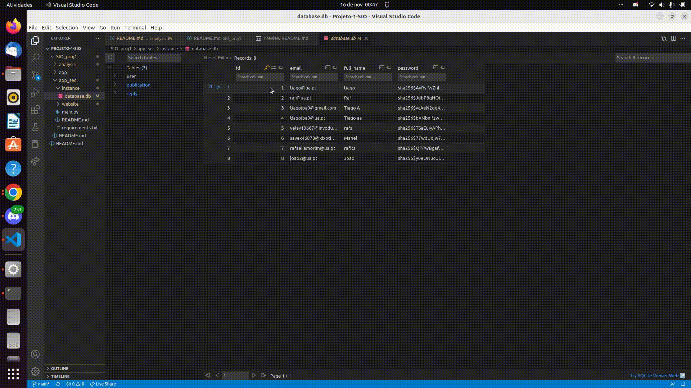
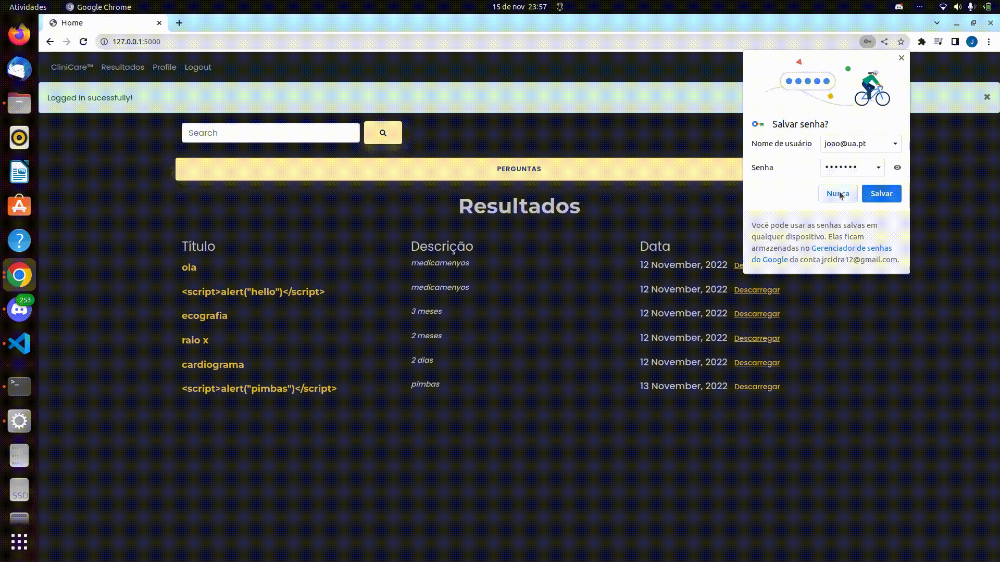
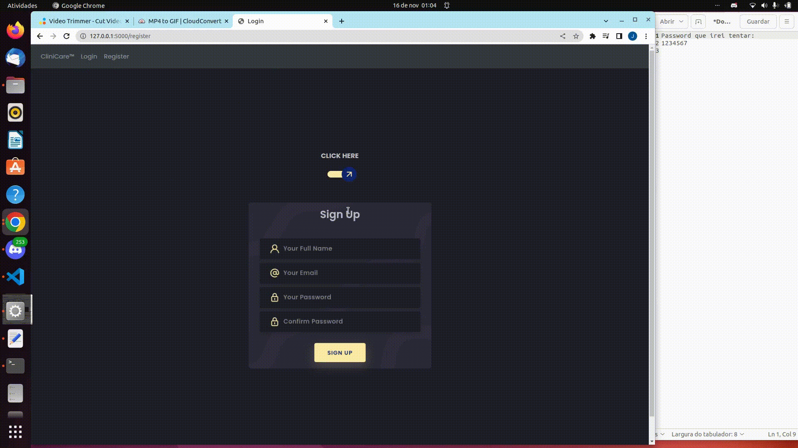

# Relatório De Vulnerabilidades

## Index
* [Introdução](#introdução)
* [CWE-79: Improper Neutralization of Input During Web Page Generation ('Cross-site Scripting')](#cwe-79-improper-neutralization-of-input-during-web-page-generation-cross-site-scripting)
* [CWE-89: Improper Neutralization of Special Elements used in an SQL Command ('SQL Injection')](#cwe-89-improper-neutralization-of-special-elements-used-in-an-sql-command-sql-injection)
* [CWE-200: Exposure of Sensitive Information to an Unauthorized Actor](#cwe-200-exposure-of-sensitive-information-to-an-unauthorized-actor)
* [CWE-256:  Improper Input Validation](/SIO_proj1/analysis/CWE%20-%20256/README.md)
* [CWE-287: Improper Authentication](#cwe-287-improper-authentication)
* [CWE-425: Direct Request ('Forced Browsing')](#cwe-425-direct-request-forced-browsing)
* [CWE-521: Weak Password Requirements](#cwe-521-weak-password-requirements)
* [Conclusão](#conclusão)

## Introdução

Este relatório tem como objetivo continuar a apresentação destas vulnerabilidades, explicá-las e demonstrá-las, tanto a serem exploradas, como também, uma solução que impede essa exploração.
Para tal optámos por criar uma aplicação em python, com recurso à framework, FLASK.

A aplicação e site desenvolvidos tentam recriar o cenário de uma clínica de saúde, na qual é possível criar uma conta, aceder a um serviço de helpdesk e obter os seus resultados. Esse, será o nosso ambiente para testar/demonstrar as vulnerabilidades.


## CWE-79: Improper Neutralization of Input During Web Page Generation ('Cross-site Scripting')

### [Definição e explicação ](/analysis/CWE%20-%2079/README.md)

Partindo já da apresentação e explicação já fornecida da vulnerabilidade, iremos demonstrar o trabalho realizado para prevenir a sua exploração.

A nossa aplicação insegura é vulnerável a XSS persistente, ou seja, um utilizador poderá inserir código javascript numa publicação, o qual ficará armazenado no website. Não só fica armazenado, como também é visível para outros utilizadores. Um desses outros utilizadores, ao abrir essa publicação, irá correr o script que contém conteúdo malicioso. Por exemplo, o script poderá redirecionar o utilizador para um link que contém vírus.

### Implementação

Como utilizámos a framework, FLASK, aproveitámos os benefícios do Jinja2, que por defeito, já protege contra ataques de XSS. Para demonstrar a vulnerabilidade, desativámos essa funcionalidade.

### Código desenvolvido

Código da aplicação insegura: 

```html
<div class="row pad">
    <div class="col-lg-12">
        <div class="panel panel-primary">
            <div class="panel-body">
                <div class="row">
                    <div class="col-lg-12">
                        <p class="big"><font size="+3">Resultado: </font><font size="+1">{{ publication.title | safe }}</font></p>
                    </div>
                    <div class="col-lg-12">
                        <p class="big"><font size="+2">Descrição: </font><font size="+1">{{ publication.description }}</font></p>
                    </div>

                    <div class="col-lg-12"> 
                        <i class="glyphicon glyphicon-calendar"></i> 
                        {{ publication.date.strftime('%d %B, %Y') }}&nbsp;   
                    </div>
                </div>
            </div>
        </div>
    </div>
</div>

```

Código da aplicação segura:

```html
<div class="row pad">
    <div class="col-lg-12">
        <div class="panel panel-primary">
            <div class="panel-body">
                <div class="row">
                    <div class="col-lg-12">
                        <p class="big"><font size="+3">Resultados: </font><font size="+1">{{ publication.title }}</font></p>
                    </div>
                    <div class="col-lg-12">
                        <p class="big"><font size="+2">Descrição: </font><font size="+1">{{ publication.description }}</font></p>
                    </div>

                    <div class="col-lg-12"> 
                        <i class="glyphicon glyphicon-calendar"></i> 
                        {{ publication.date.strftime('%d %B, %Y') }}&nbsp;   
                    </div>
                </div>
            </div>
        </div>
    </div>
</div>

```

### Exemplos

#### Vulnerável


#### Segura




## CWE-89: Improper Neutralization of Special Elements used in an SQL Command ('SQL Injection')


### [Definição e explicação ](/analysis/CWE%20-%2089/README.md)


Antes de passarmos à demonstração, teremos de compreender a forma como a comunicação é feita, como são enviados e recebidos dados, para podermos perceber como SQL injections podem acontecer.

Existem 3 passos que teremos de considerar:

1.  O cliente faz pedido ao servidor (Request)
2.  O servidor processa o pedido e recolhe ou altera dados da base de dados
3.  O servidor responde ao cliente, devolvendo dados.


Se ações não forem tomadas e o passo 2 não tiver mecanismos de proteção, um atacante poderá realizar uma SQL Injection.





### Implementação


Na nossa aplicação as SQL Injections são exploradas à volta do login. Na aplicação insegura, um atacante poderá fazer login sem necessitar da password.

Simplesmente precisa de um email válido e adicionar "'--//" e o login será realizado com sucesso, sendo a password ignorada.

No código da aplicação insegura, não possuímos nada que verifique se num dado campo de texto existam caratéres que possam causar uma sql injection. 

### Código desenvolvido


Aplicação vulnerável:

``` python
def login():
    if request.method=='POST':
        email=request.form.get('email')
        password=request.form.get('password')
        if email=="" or password=="":
            flash('Invalid Credentials',category='error')
            return render_template("login.html", user=current_user)
        sql=f"SELECT * FROM User WHERE email='{email}' AND password='{password}'"
        
        user = User.query.from_statement(db.text(sql)).first()
        if user:
            flash('Logged in sucessfully!',category='sucess')
            login_user(user,remember=True)
            return redirect(url_for('views.home'))
        else:
            flash('Incorrect password,try again.',category='error')
    return render_template("login_healthclinic.html", user=current_user)


```


Já na aplicação segura, existem condições e código adicional para verificar esses dados campos de texto para evitar SQL Injections.

Aplicação segura:

``` python
def login():
    if request.method=='POST':
        email=request.form.get('email')
        password=request.form.get('password')
        if email.find('/'): email.replace('/','\'')
        if email.find('-'): email.replace('-','\-')
        if email.find('"'): email.replace('-','\"')
        if password.find('/'): password.replace('/','\'')
        if password.find('-'): password.replace('-','\-')
        if password.find('"'): password.replace('-','\"')
        user=User.query.filter_by(email=email).first()
        if user:
            if check_password_hash(user.password,password):
                flash('Logged in sucessfully!',category='sucess')
                login_user(user,remember=True)
                return redirect(url_for('views.home'))
            else:
                flash('Invalid Credentials, try again!',category='error')
        else:
            flash('Invalid Credentials, try again!',category='error')
    return render_template("login_healthclinic.html", user=current_user)

```


### Exemplos

#### Vulnerável



#### Segura




## CWE-200: Exposure of Sensitive Information to an Unauthorized Actor


### [Definição e explicação ](/analysis/CWE%20-%20200/README.md)

Uma vez que criámos uma aplicação e website que "atende" vários utilizadores, é importante respeitar a privacidade dos dados de cada um, criar um abiente no qual um utilizador X não acede aos dados do Utilizador Y.

Sempre que uma conta é criada, esta é registada na base dados e associada a um id. Na aplicação insegura o url respetivo à página de um perfil contém o id dessa conta, logo um atacante pode aceder a contas de outros utilizadores alterando o id.


### Código desenvolvido

Código da aplicação vulnerável:

```python
@auth.route ('/profile/<userid>',methods=['GET','POST'])
@login_required
def profile(userid):
    userr=User.query.get(int(userid))
    return render_template("Pessoa.html",user=userr)


```

Na aplicação segura, o id não faz parte do url, logo um atacante não poderá explporar esta possibilidade.

```python
@auth.route ('/profile',methods=['GET','POST'])
@login_required
def profile():
    return render_template("Pessoa.html",user=current_user)


```


### Exemplos

#### Vulnerável



#### Segura


## CWE-256:  Storing a password in plaintext may result in a system compromise
### [Definição e explicação ](/analysis/CWE%20-%20256/README.md)
### Exemplos


Código da aplicação vulnerável:
```python
new_user = User(email=email,full_name=full_name,password=password)
                db.session.add(new_user)
```

Código da aplicação segura:
```python
new_user = User(email=email,full_name=full_name,password=generate_password_hash(password,method='sha256'))
db.session.add(new_user)
```


#### Vulnerável


#### Segura


## CWE-287: Improper Authentication

### [Definição e explicação ](/analysis/CWE%20-%20287/README.md)

Se uma plataforma/website não tiver mecanismos de verificação de identidade, um atacante poderá dizer que é outra pessoa sem ter que o provar, um cenário que não é ideal. Para exemplificar em maior detalhe, iremos partir da nossa aplicação.

Na nossa aplicação, caso um utilizador se esqueça da password, é lhe possível trocá-la, assumindo que este sabe qual é o seu email. Mas existe um pequeno detalhe que torna este processo extremamente inseguro na nossa aplicação vulnerável 


### Cenário de exemplo


Vamos assumir que o utilizador X, possui uma conta registada com o seguinte email: "utilizadorx@gmail.com", mas esqueceu-se da password. O utilizador X pode pedir para alterar a password, fornecendo o seu email apenas e alterá-la. Conseguiu o que pretende e, talvez, nem se apercebeu do quão fácil é ao atacante roubar a sua conta.

Para esse cenário imaginemos que o atacante conhece o email do utilizador X, mas não a sua password. Realiza o processo de troca de password e, rapidamente, consegue aceder à sua conta e roubar dados.

### Código desenvolvido

Código da aplicação vulnerável:

```python
@auth.route ('/resetpassword',methods=['GET','POST'])
def reset_password():
    if current_user.is_authenticated:
        return redirect(url_for('views.home'))
    form = ResetPasswordForm()
    user = User.query.filter_by(email=form.email.data).first()
    if user:
        if form.validate_on_submit():
            password=request.form.get('password')
            if password.find('/'): password.replace('/','\'')
            if password.find('-'): password.replace('-','\-')
            if password.find('"'): password.replace('-','\"')
            
            user.password = password
            db.session.commit()
            flash('Your password has been updated! You are now able to log in',category='success')
            return redirect(url_for('auth.login'))
        
    else:
        return render_template('reset_token.html',title='Reset Password',form=form,user=current_user)
```


Já na aplicação segura, há mais passos do que apenas inserir o email. Será enviado um link para o email do utilizador, o qual só ele deverá ter acesso, onde poderá trocar a sua password. 

Código da aplicação segura:

```python
def send_reset_email(user):
    mail=Mail(current_app)
    token = user.get_reset_token()
    msg = Message('Password Reset Request', sender='ehealthcareproj1@gmail.com', recipients=[user.email])
    msg.body = f'''To reset your password, visit the following link:
{url_for('auth.reset_token', token=token, _external=True)}

If you did not make this request then simply ignore this email and no changes will be made.
'''
    mail.send(msg)

@auth.route ('/resetpassword',methods=['GET','POST'])
def reset_request():
    if current_user.is_authenticated:
        return redirect(url_for('views.home'))
    form = RequestResetForm()
    if form.validate_on_submit():
        user = User.query.filter_by(email=form.email.data).first()
        send_reset_email(user)
        flash('An email has been sent with instructions to reset your password.',category='sucess')
        return redirect(url_for('auth.login'))
    return render_template('reset_request.html',title='Reset Password',form=form,user=current_user)

@auth.route ('/resetpassword/<token>',methods=['GET','POST'])
def reset_token(token):
    if current_user.is_authenticated:
        return redirect(url_for('views.home'))
    user = User.verify_reset_token(token)
    if user is None:
        flash('That is an invalid or expired token',category='error')
        return redirect(url_for('auth.reset_request',user=current_user))
    form = ResetPasswordForm()
    if form.validate_on_submit():
        password=request.form.get('password')
        has_symbol = False
        for c in '~!@#$%^&*()_+=-`':    
            if c in password:
                has_symbol = True
                break
        
        if password.find('/'): password.replace('/','\'')
        if password.find('-'): password.replace('-','\-')
        if password.find('"'): password.replace('-','\"')
        
        if len(password) < 10:
            flash('Password must be at least 10 characters.', category='error')
        if re.search('[0-9]',password) is None:
            flash('Make sure your password has a number in it', category='error')
        if re.search('[A-Z]',password) is None:
            flash('Make sure your password has a uppercase letter in it', category='error')
        if not has_symbol:
            flash('Make sure your password has a symbol in it', category='error')
        else:
            hashed_password = generate_password_hash(password,method='sha256')
            user.password = hashed_password
            db.session.commit()
            flash('Your password has been updated! You are now able to log in',category='success')
            return redirect(url_for('auth.login'))
    return render_template('reset_token.html',title='Reset Password',form=form,user=current_user)
```

### Exemplos

#### Vulnerável


#### Segura


## CWE-425: Direct Request ('Forced Browsing')

### [Definição e explicação ](/analysis/CWE%20-%20425/README.md)


Em quase todas as plataformas atuais, existe sempre conteúdo público e privado. Esse conteúdo público, por norma é acessível por qualquer pessoa, sem necessidade de autenticação, já o privado é o contrário. 

Esta vulnerabilidade, permite a um atacante aceder a conteúdo que lhe é privado. Este atacante pode simplesmente inserir o url, respetivo a uma publicação, e acederá à mesma.

Na nossa aplicação segura, é necessário ter o login feito para ver uma publicação.


### Código desenvolvido

Código da aplicação vulnerável:
```python
@views.route('/publication/<publication_id>', methods=['GET', 'POST'])
def publication(publication_id):
    form = NewReply()
    
    pub = Publication.query.get(int(publication_id))
    
    if form.validate_on_submit():
        if not current_user.is_authenticated:
            flash('You must be logged in to reply')
            return redirect(url_for('views.publication', publication_id=publication_id))
        else:
            if form.content.data=="":
                flash('Need to write something',category='error')
                replies = Reply.query.filter_by(publication_id=publication_id).all()
                return render_template('publication.html', publication=pub, form=form, replies=replies, user=current_user)
            reply = Reply(user_id=current_user.id, content=form.content.data, date=datetime.now())
            pub.replies.append(reply)
            db.session.commit()

    replies = Reply.query.filter_by(publication_id=publication_id).all()

    return render_template('publication.html', publication=pub, form=form, replies=replies, user=current_user)

```

Código da aplicação segura:
```python
@login_required

def publication(publication_id):

    form = NewReply()

    pub = Publication.query.get(int(publication_id))
    
    if form.validate_on_submit():
        if not current_user.is_authenticated:
            flash('You must be logged in to reply')
            return redirect(url_for('views.publication', publication_id=publication_id))
        else:
            if form.content.data=="":
                flash('Need to write something',category='error')
                replies = Reply.query.filter_by(publication_id=publication_id).all()
                return render_template('publication.html', publication=pub, form=form, replies=replies, user=current_user)
            reply = Reply(user_id=current_user.id, content=form.content.data, date=datetime.now())
            pub.replies.append(reply)
            db.session.commit()
    replies = Reply.query.filter_by(publication_id=publication_id).all()

    return render_template('publication.html', publication=pub, form=form, replies=replies, user=current_user)

```

### Exemplos

#### Vulnerável


#### Segura


## CWE-521: Weak Password Requirements

### [Definição e explicação ](/analysis/CWE%20-%20521/README.md)

Já tendo sido dada uma explicação e definição, vamos oferecer algum contexto no porquê da necessidade de alguma exigência na criação de uma password.

Primeiro, apresentaremos o top 10 de palavras-passes e o tempo que um hacker precisaria para a adivinhar.

|Palavra-passe | Tempo necessário para adivinhar | Nº de users com a dada palavra-passe|
| :---: | :---: | :---: |
| password | < 1 sec | 4,929,113 |
| 123456 | < 1 sec | 1,523,537|
| 123456789 | < 1 sec| 413,056|
| guest| 10 secs| 376,417|
| qwerty| < 1 sec | 309,679 |
| 12345678|< 1 sec |284,946 |
|111111 |< 1 sec | 229,047|
|12345 | < 1 sec|188,602|
|col123456 |11 Seconds | 140,505|
|123123 |< 1 sec |127,762 |

[by nordpass](https://nordpass.com/most-common-passwords-list/)

Como vemos, um atacante iria, rapidamente, ter a nossa palavra-passe. Teremos de ser mais exigentes nesta criação. Para avaliar o quão segura uma palavra-passe é, iremos utilizar o [passwordmonster](https://passwordmonster.com). 

Vamos supor três palavra-passes, todas elas com o mesmo tamanho, 14 caratéres. A primeira palavra-passe terá caratéres numéricos e alfabéticos, as letras serão só minúsculas. A segunda palavra-passe terá caratéres alfabéticos, numéricos e especiais. A terceira palavra-passe terá as mesmas condições da anterior, mas também possuirá minúsculas e maiúsculas.

1º-> abcd1234rae4ty

2º-> abcd+1234*dsc_

3º-> AbCd_1678@AGVC

|Password| Tempo necessário para adivinhar|
| :---: | :---: | 
|  1ª (abcd1234rae4ty)|  2 horas |
|  2ª (abcd+1234*dsc_)|  5 anos |
|  3ª (AbCd_1678@AGVC)|  235 anos |


### Código desenvolvido

Código da aplicação vulnerável:

```python
@auth.route ('/resetpassword',methods=['GET','POST'])
def reset_password():
    if current_user.is_authenticated:
        return redirect(url_for('views.home'))
    form = ResetPasswordForm()
    user = User.query.filter_by(email=form.email.data).first()
    if user:
        if form.validate_on_submit():
            password=request.form.get('password')
            if password.find('/'): password.replace('/','\'')
            if password.find('-'): password.replace('-','\-')
            if password.find('"'): password.replace('-','\"')
            
            user.password = password
            db.session.commit()
            flash('Your password has been updated! You are now able to log in',category='success')
            return redirect(url_for('auth.login'))
        
    else:
        return render_template('reset_token.html',title='Reset Password',form=form,user=current_user)    
```

Código da aplicação segura:

```python
def reset_token(token):
    if current_user.is_authenticated:
        return redirect(url_for('views.home'))
    user = User.verify_reset_token(token)
    if user is None:
        flash('That is an invalid or expired token',category='error')
        return redirect(url_for('auth.reset_request',user=current_user))
    form = ResetPasswordForm()
    if form.validate_on_submit():
        password=request.form.get('password')
        has_symbol = False
        for c in '~!@#$%^&*()_+=-`':    
            if c in password:
                has_symbol = True
                break
        
        if password.find('/'): password.replace('/','\'')
        if password.find('-'): password.replace('-','\-')
        if password.find('"'): password.replace('-','\"')
        
        if len(password) < 10:
            flash('Password must be at least 10 characters.', category='error')
        if re.search('[0-9]',password) is None:
            flash('Make sure your password has a number in it', category='error')
        if re.search('[A-Z]',password) is None:
            flash('Make sure your password has a uppercase letter in it', category='error')
        if not has_symbol:
            flash('Make sure your password has a symbol in it', category='error')
        else:
            hashed_password = generate_password_hash(password,method='sha256')
            user.password = hashed_password
            db.session.commit()
            flash('Your password has been updated! You are now able to log in',category='success')
            return redirect(url_for('auth.login'))
    return render_template('reset_token.html',title='Reset Password',form=form,user=current_user)
```

# Exemplos

## Vulnerável



<br>

## Segura


## Conclusão

Com a realização deste trabalho, expandimos o conhecimento que possuíamos em vulnerabilidades. Partindo do que já tinha sido obtido nas aulas (principalmente as duas primeiras) e, através de pesquisa e realização de tarefas, complementámo-lo com mais ainda. 

Não só aprendemos e adquirimos experiência com uma linguagem/framework ou acerca de detalhes de uma dada vulnerabilidade, mas também demos por nós a perguntar, "O que poderá um atacante fazer para comprometer a nossa aplicação ou a aceder a dados que lhe são privados?", ou seja, tivemos que pensar à frente para criar a app segura por forma a evitar os diferentes ataques.
